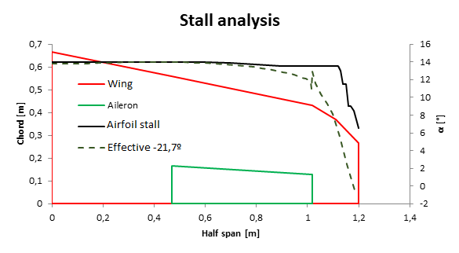
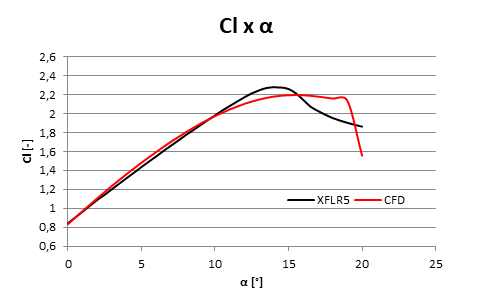
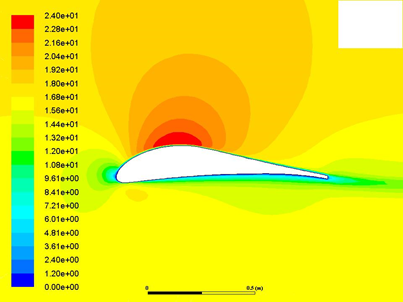

    

#
# Aerodesign UTFPR - Aerodynamics project
This is a project developed for the 2017 SAE Aerodesign - Brasil competition regulated by [SAE International](https://www.sae.org/). The goal of the competition is to present and phisically test a project of a airplane in scale based on the regulation and specifications required by SAE. The aircrafts are developed by teams representing multiple universities and higher education institutions of Brasil. To understand more about the competition please access the official website of the competition [saebrasil.org.br/programas-estudantis/aero-design-sae-brasil/](https://saebrasil.org.br/programas-estudantis/aero-design-sae-brasil/).

This project was part of the 2017 SAE Aerodesign - Brasil competition representing the Federal University of Technology – Paraná (UTFPR) with the team Aerodesign UTFPR. You can find more about the team by its official social media:

- Official website: [keep up with Aerodesign UTFPR](https://utfpraerodesign.wixsite.com/aero)
- Facebook: [follow Aerodesign UTFPR on Facebook](https://www.facebook.com/AeroUTFPRCuritiba/)
- Instagram: [follow Aerodesign UTFPR on Instagram](https://www.instagram.com/aeroutfprcuritiba/)

This repository contains specifically the part of the project related to aerodynamics studies, which I was part of and responsible for simulations.

## Project targets

This project aimed to improve the operation conditios of the surfaces of the wings providing lift to the aircraft. One of the goals was to validate the choice of a specific airfoil for the wings to obtain more points on the tests during the competition. A study of the chosen airfoil in a computer aided simulation was also included in the analysis to validate the project. One of the most important aspects of the evaluation of each project is the capacity of carrying high loads in comparison to the total weight of the aricraft, therfore, the study developed in this section of the project has a important impact on the final results.

## Airfoil selection

There are some known airfoils designed for differente applications. One of the airfoils known to deliver high lift coeficients, which means a good performance with lifting high ratios of load, is SELIG 1223. So, in order to try and improve this requirement of our project, we designed two differents profiles based on SELIG 1223 geometry, represented in figure 1 and had them simulated on a pre-project software, to understand the first impact of the changes that were made. Through the software [XFLR5®](http://www.xflr5.tech/xflr5.htm), we could generate the diagrams that represent the lift, shown in figure 2, and momentum, shwon in figure 3, as a function of the attack angle α angle that the wing is experiencing when taking off or landing.

1)

    

2)

    

3)

    

## Wing geometry design

The wing geometry is mainly defined by its aspect ratio (AR) - the ratio between the length on the direction of the movement (chord) and the span of the wing - the projected area of the wing and the type of geometry, that is, eliptical, trapezoid, constant chord and variations of theese. That said, by revision of literature, we came to understand that the trapezoid wing is the one that provides the most efficient flight and also a moderate difficulty to fabricate. The aspect ratio was specified by a study with the project of performance, which studies the pull traction of the engine and propellers. The maximum take off weight (MTOW) is related to the ambient conditions, which was estimated taking into account the city where the competitio takes place, the coefficients obtained from the airfoil selected and the area of the wing, so, we iterated different AR's to obtain the greater maximum take off weight and also a geometry that could provide the area of wing needed. The diistribution of differente AR's and MTOW is represented by the following image 4 and the final configuration of the wing is shown in image 5.

4)

    

5)

    

## Stall analysis

The definition of the ailerons - dynamic parts of the wing used to control the flight -  was studied alongside the stall analisys, that is, the condition given by the attack angle and velocity of the aircraft in which the wing cannot provide enough lift to sustain the aircraft. Using the simulation in [XFLR5®](http://www.xflr5.tech/xflr5.htm) of our conceptual wing, and the stall angle known from the airfoil previous simulation, it was possible to obtain the minimum lenght in which it was possible to place the ailerons so that it would not suffer from stall.

6)

    

## CFD analysis

Alternatively, we added a CFD analysis simulation of the airfoil used in the project to improve the quality of the project and to obtain other ends of validation of our project. The study was developed using the software [Fluent - ANSYS®](https://www.ansys.com/products/fluids/ansys-fluent). The goal was to produce a fine mesh that was representative and to obtain the coefficients associated with our airfoil to compare with the results obtained using [XFLR5®](http://www.xflr5.tech/xflr5.htm).

The mesh was produced using a structured grids with regular connectivity and quadrilateral elements. It was considered 4 regions to make smoother the transition in elements geometry and a more refined mesh as it got closer to the airfoil.

7)

    

It was taken into account the same ambient conditios as in  XFLR5 , using a temperature of 20º C and a velocity of 17 m/s. We obtained the following results, in comparison with the previous simulation: lift coefficient, figure 8; drag coefficient, figure 9.

8)

    

9)

    

We also obtained the following results representing pressure distribution, figure 10; velocity distribution, figure 11.

10)

    

11)

    

## Prototype and competiion

The overall aim of the project is to integrate students and make it possible the developement of a project that allies multiple areas of knowledge, some studied in graduation courses, some not, also the team work, also well needed during the production stages of the project. The final aircraft prototype is presented in the following image alongside our team during the 2017 SAE Aerodesign Competition in São José dos Campos, SP, Brasil.

    

